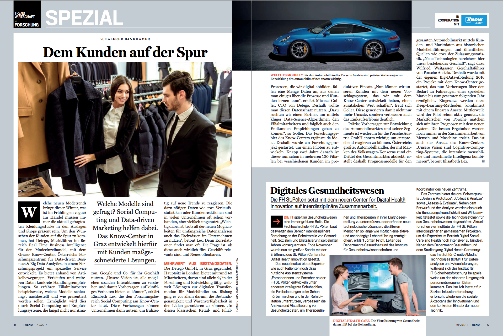

## Project Overview _(June 2016 – December 2016)_

At Know Center Research, we collaborated with with Detego Fashion who leverage patented RFID technology to track garments from manufacturing through retail, enhancing inventory accuracy and customer experience. Fashion brands including Levi’s, Adidas, and Reiss use this technology for in-store tracking, real-time stock visibility, and online order fulfillment. Our task was to implement a real-time outlier detection system to optimize garment placement within retail stores, boosting sales for low-performing items.

## Technical Challenges

Key challenges included:

- Designing a reliable, real-time data processing pipeline
- Ensuring robust and accurate data cleaning and preprocessing
- Integrating an effective outlier detection algorithm capable of handling retail data complexity

## Technologies & Methods

The solution integrated multiple technologies and methods:

- **Architecture:** Microservices with Java, Spring Boot, Swagger, RabbitMQ
- **Data Storage:** Apache Solr for data indexing and retrieval
- **Machine Learning & Analysis:** Python (numpy, pandas, sklearn, scipy) for outlier detection using Mahalanobis distance
- **Data Processing:** Java-based real-time data pipeline, integration with Python scripts for data analysis
- **CI/CD & Testing:** Extensive testing (JUnit, integration tests), Agile development methodology
- **Deployment:** Production-ready solution deployed in a retail environment

## Results & Impact

- Delivered a fully operational real-time outlier detection pipeline
- Enabled automated and intelligent decision-making for garment placement
- Enhanced sales performance by optimizing store layouts and merchandising
- Featured as a success story in Austria’s Trend magazine

## Personal Contribution

As a Software Engineer and ML Engineer on this project, my responsibilities included:

- Designing and developing the end-to-end data processing pipeline in Java
- Integrating and orchestrating the real-time execution of the outlier detection algorithm developed by a colleague in Python
- Ensuring seamless communication between microservices and the Python components
- Conducting extensive testing and validation to ensure reliable, accurate predictions
- Deploying and maintaining the solution in production environments

The project was recognized as a notable industry success and was featured in the Austrian Trend magazine.
