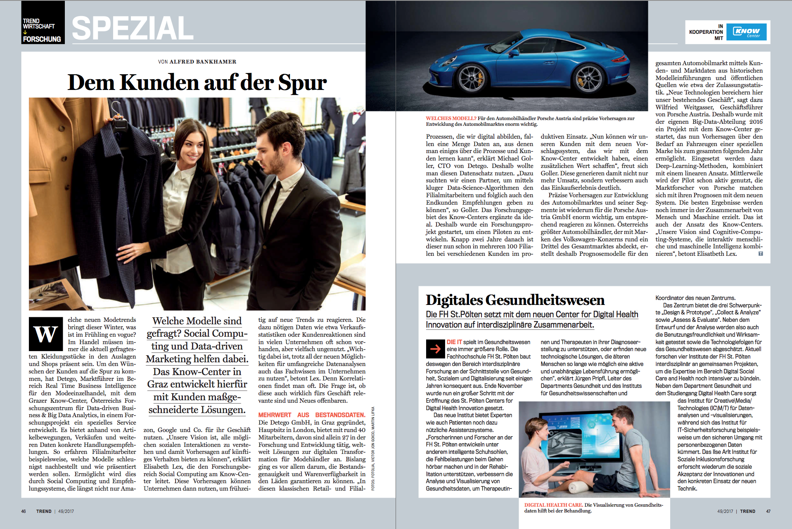

## Project Overview _(July 2016 – July 2018)_

At Know Center Research, we collaborated with Porsche Holding GmbH (Porsche Holding Salzburg), Europe's largest automotive distributor, representing Volkswagen Group brands in wholesale, retail, and after-sales services. Porsche sought an accurate time-series prediction solution to optimize monthly car orders based on historical sales data.

## Technical Challenges

Key challenges faced in this project included:

- Handling large and varied time-series datasets
- Performing thorough data cleaning and exploratory analysis
- Conducting comprehensive hyperparameter optimization
- Implementing accurate linear and non-linear predictive models

## Technologies & Methods

The solution was built using advanced data analytics and visualization tools:

- **Machine Learning & Analysis:** Python, R, ARIMA, SARIMA, LSTM neural networks (Keras)
- **Data Visualization & Dashboard:** Interactive dashboards using Plotly
- **Data Exploration & Cleaning:** Extensive data preprocessing, feature engineering, and exploratory data analysis (EDA)
- **Research & Publication:** Scientific publication highlighting methodology and results

## Results & Impact

- Delivered an end-to-end predictive analytics dashboard integrated into Porsche Holding's operational processes
- Improved accuracy in predicting monthly car order requirements
- Recognized internally with the company's Project Excellence Silver Award
- Successfully collaborated on a research publication titled "Gone in 30 days! Predictions for car import planning" in the journal Information Technology
- Featured as a success story in Austria’s Trend magazine

## Personal Contribution

As a Software Engineer, ML Engineer, and Data Scientist, my responsibilities included:

- Developing the complete data processing and cleaning pipeline
- Conducting extensive data exploration and feature engineering
- Researching and implementing linear and non-linear time-series predictive models (ARIMA, SARIMA, LSTM)
- Creating interactive visualizations and predictive analytics dashboards with Plotly
- Co-authoring the research publication and presenting